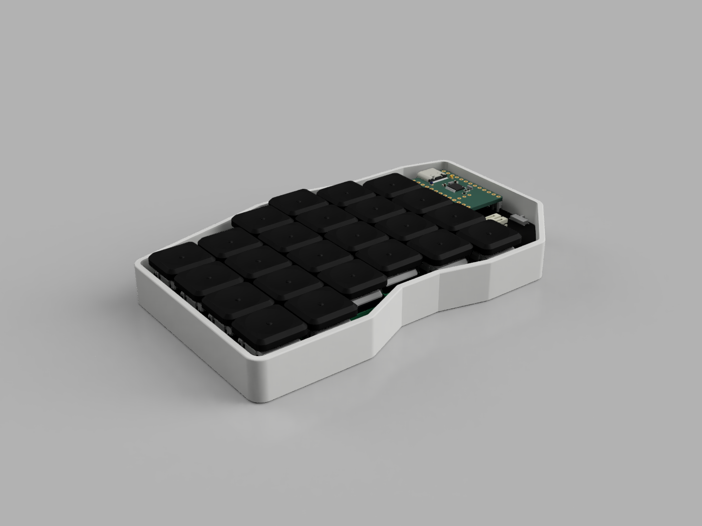

# Venturi - 48 Key Split Keyboard
*Code name: Model 901*

My first PCBs, first personal electronics project, and much more. This has been a lot of firsts so please excuse mistakes. Key inspiration is also mentioned below.

Steal from the best, invent the rest

## Overview
The Venturi (aka model 901, venturi48) is a 48-key split, ergonomic keyboard. I can use lots of descriptors, but you can find that in the features section. 

## Contents
- All the KiCad files, including schematics and PCB
- All CAD Files including an assembly including all the components on the left side and cases for both
- ZMK firmware for Venturi
- Production files as used for production

## Images

## Features
- **48 Keys**  - All laptop keys within 2 layers, with additional layers for extra functionality. 
- **Wireless** - One less cable to worry about! 2x 110 maH LiPO Batteries, 2+ week battery life (estimated). Seamless multi-device operation.
- **Column Stagger** - Some mild colstag makes it more comfy to type on by better suting the different finger lengths
- **Keyboard Continuity** - Closer layout to a Macbook or general keyboard than most ergo KBs, so that you're not mad at all other keyboards while using this
- **Low Profile**  - Thinner = Better? More portable and less of an upward angle on the wrists, no need for a wrist rest 
- **Portable** - Easy on the go typing via a 3d print to easily carry it without risking damage in a backpack
- **Hot-Swappable** - Changed your mind on those clicky switches? Or maybe you're looking for a change of pace? The Venturi has you covered with hotswap switches!
- **Magsafe** - Not to wirelessly charge or to attach to the back of your phone, but for convenient tenting or to check if that coin is magnetic or not (it wasn't)

## BOM (For Hackclub Stardance Purposes)
|Purchase Status|Part                           |Qty|Price/per (CAD)|Total |Link                             |Shipping/Tax|Notes                    |
|---------------|-------------------------------|---|---------------|------|---------------------------------|------------|-------------------------|
|               |NRF52840 Dev Board             |2  |$3.95          |$7.90 |https://a.aliexpress.com/_mrUhUVZ|            |MC                       |
|               |MSK12C02 (20 pack)             |1  |$3.85          |$3.85 |https://a.aliexpress.com/_mLPJnJ1|            |Power Switch             |
|               |JST PH 2.0 Bent Plug (100 pack)|1  |$2.61          |$2.61 |https://a.aliexpress.com/_m0dvH4j|            |Battery Connector        |
|               |1N4148W Diode (100 pack)       |1  |$2.07          |$2.07 |https://a.aliexpress.com/_mNCQ5SX|            |Diodes                   |
|               |Choc Hotswap Socket (70 pack)  |1  |$10.48         |$10.48|https://a.aliexpress.com/_mq1DDpN|            |Hotswap Socket           |
|               |2.54mm socket (10 pack)        |1  |$2.64          |$2.64 |https://a.aliexpress.com/_mtOu6HZ|            |Sockets for MC           |
|               |KailH Choc Pro Red             |1  |$32.26         |$32.26|https://a.aliexpress.com/_mKtAtkx|            |Switch                   |
|               |301230 Battery JST             |2  |$5.19          |$10.38|https://a.aliexpress.com/_mt5WUH1|6.18        |Battery                  |
|               |JLCPCB PCB                     |1  |$17.73         |$17.73|                                 |12.37       |PCB (no link available)  |
|               |FNIRSI HS-02A Basic            |1  |$39.44         |$39.44|https://a.aliexpress.com/_mKQRvMj|            |Soldering Iron           |
|               |Magsafe Ring (6)               |1  |$7.51          |$7.51 |https://a.aliexpress.com/_mtm6duj|            |Magsafe Ring for Mounting|
|               |20g Lead-free solder           |1  |$5.29          |$5.29 |https://a.aliexpress.com/_mKjygpD|            |Soldering                |
|               |Flux Pen 10mL                  |1  |$4.98          |$4.98 |https://a.aliexpress.com/_mKjygpD|            |Flux for soldering       |
|               |                               |   |               |$0.00 |                                 |            |                         |
|               |                               |   |               |$0.00 |                                 |            |                         |
|               |TOTAL (CAD)                    |   |$165.69        |$0.00 |                                 |            |                         |
|               |TOTAL (USD)                    |   |$119.30        |$0.00 |                                 |            |                         |

